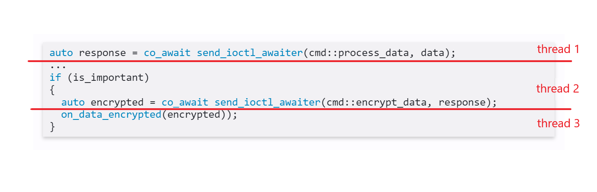
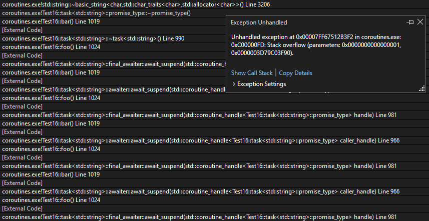

## Coroutines
in C++
<p class="small-text">
                  Jozef Grajciar
</p>

---

C++ is a language for developing and using elegant and efficient abstractions.  
<p class="small-text">
Bjarne Stroustrup, The C++ Programming Language (4th Edition)
</p>

---

<!--
header: 'Process data'
-->

## Motivation : Process data

* read data from file
* process data

---

```c++
std::vector<data> current_data = read_data();

for (const auto& data : current_data)
  process_data(data);
```

---

<!-- Scoped style -->
<style scoped>
.test {
  color: #4325;
  vertical-align: bottom;
}
</style>

```c++
std::vector<data> current_data = read_data();

for (const auto& data : current_data)
  process_data(data);
```

<br />

__Problem__: not possible to read all data to memory.

* We can create *reader class* 

---

```c++
  struct data_reader
  {
    data_reader();
    std::optional<data> next();
    std::ifstream file;
  };

  data_reader reader;

  while (auto data = reader.next())
    process_data(*data);
```

---

```c++
struct data_reader
{
  struct iterator
  {
    using iterator_category = std::forward_iterator_tag;
    using difference_type   = std::ptrdiff_t;
    using value_type        = data;
    using pointer           = data*;
    using reference         = data&;

    reference operator*();
    pointer operator->();
    Iterator& operator++();
    friend bool operator== (const iterator& a, const iterator& b);
    friend bool operator!= (const iterator& a, const iterator& b);
```

---

__Problem__: data can be read from multiple sources: file, DB, registry ...

```c++
struct data_reader_file : public data_reader;

struct data_reader_db : public data_reader;

struct data_reader_registry : public data_reader;
```

---

Solution using coroutines:

```c++
for (const auto& data : read_data())
  process_data(data);
```

---

```c++
#include <experimental/generator>

std::experimental::generator<data>read_data()
{
  data current_data;

  std::ifstream file(...);
  while(file >> current_data)
    co_yield current_data;

  db_handle handle = open_db_handle();
  while(get_data_from_db(handle, current_data))
    co_yield current_data;
}
```

---

<!--
header: 'Asynchronous commands'
-->

## Motivation : Asynchronous commands

* process commands asynchronously in multiple threads
* send command to server
* receive response in some receiver thread

---

send_ioctl:

```c++
using buffer = std::vector<uint8_t>;
using response_cbk = std::function<void(const buffer&)>;

bool send_ioctl(Cmd command,
               const buffer& input,
               response_cbk response);
```
* `send_ioctl` is non-blocking
* `response_cbk` is called in some other receiver thread - _continuation_
* similar to `boost::future.then()`

---

<!--
```c++
   send_ioctl(cmd::process_data, data, [&](const buffer& response)
   {
      ...
      if (is_important)
      {
        send_ioctl(cmd::encrypt_data, response, [&](const buffer& encrypted)
        {
          on_data_encrypted(encrypted));
        }
      }
   });
```
-->

```c++
void func1()
{
  ...
  send_ioctl(cmd::process_data, data, on_data_processed);
```

```c++
void on_data_processed(const buffer& response)
{
  ...
  if (is_important)
  {
    send_ioctl(cmd::encrypt_data, response, on_data_encrypted);
```

```c++
void on_data_encrypted(const buffer* buffer)
{
  ...
```

---

* may lead to __callback hell__
* may become hard to reason when flow is spread among multiple lambdas/callbacks

---

Solution using coroutines:
```c++
auto response = co_await send_ioctl_awaiter(cmd::process_data, data);
...
if (is_important)
{
  auto encrypted = co_await send_ioctl_awaiter(cmd::encrypt_data, response);
  on_data_encrypted(encrypted));
}
```

---



---

```c++
struct send_ioctl_awaiter
{
    send_ioctl_awaiter(command cmd, buffer data);

    bool await_ready() { return false; }

    void await_suspend(std::coroutine_handle<> handle)
    {
        send_ioctl(input_cmd, input_data, [this, handle](buffer res)
        {
            result = res;
            handle.resume();
        });
    }

    buffer await_resume() { return result; }
};
```

---

<!--
header: What is a coroutine
-->

## What is a coroutine

* extension of a subroutine

* __subroutine__
  - __call__ - transfer execution to callee
  - __return__ - return execution back to caller

* __coroutine__
  - __suspend__ - suspend execution of coroutine
  - __resume__ - resume execution
  - __destroy__ - discard coroutine frame

---

<!--
header: Coroutine support
-->

## Coroutine support in language

Three new language keywords
* `co_await`
* `co_yield`
* `co_return`

Function which contains any of these keywords is coroutine.  
Coroutine can't be distinguished from declaration (implementation detail).

<!--
Compiler to compile the function as a coroutine rather than as a normal function.
-->

---

Several new types:
* `coroutine_handle<P>`
* `coroutine_traits<Ts...>`
* `suspend_always`
* `suspend_never`

---

Two kinds of interfaces which provides *extension points*:
* __Awaitable__ - generates `Awaiters` for suspensions
* __Promise__ - defines behavior of whole coroutine


<!--
This is all we have in the language regarding coroutines.
-->

---

<!--
header: co_await
-->

## co_await

* New language keyword.
* Usable only in context of coroutine.
* Can eventually suspend execution.
* `co_await <expr>` call `<expr>` should result to `Awaitable` or `Awaiter` object.
* `<expr>` can be transformed by promise using `await_transform` method.

---

### Awaitable

* Type that implements `operator co_await` .
* Operator should return `Awaiter` object.
* `Awaitable` can be used directly as `Awaiter`.

---

### Awaiter

* `co_await` call is translated to series of calls of `Awaiter` type object.

```c++
struct Awaiter
{
  bool await_ready();

  bool/void await_suspend(std::coroutine_handle);

  auto await_resume();
}
```

<!--
coroutine_handle is passed to await_suspend, awaiter can resume coroutine in continuation-passing style
-->

---

### Awaitable -> Awaiter -> Generated code

* co_await `<anything>` -> call to `await_transform`
* co_await `Awaitable` -> call to `operator co_await`
* co_await `Awaiter`

---

### example

```c++
my_coroutine coroutine()
{
  auto some_input = co_await 123;
}
```

---

```c++
struct my_coroutine
{
  struct promise_type
  {
    my_awaitable await_transform(int value);
  };
};
```

---

```c++
struct my_coroutine
{
  struct promise_type
  {
    my_awaitable await_transform(int value);
  };
};
```

```c++
struct my_awaitable
{
  my_awaiter operator co_await() const noexcept;
};
```

---

Provide `Awaiter` directly to `co_await`.

```c++
my_coroutine coroutine()
{
  auto some_input = co_await my_awaiter{};
}
```

<!-- 
We may also return my_awaitable here.
-->

---

### Generated code

```c++
{
  if (!awaiter.await_ready())
  {
    <suspend-point>

    if (awaiter.await_suspend(handle))
    {
      <return-to-caller>
    }

    <resume-point>
  }

  return awaiter.await_resume();
}
```

<!-- 
<return-to-caller> - coroutine is suspended and execution is returned to caller. Caller must caller `resume()` on coroutine_handle to resume execution of coroutine at <resume-point>.
handle - handle of coroutine where co_await is being expanded
await_suspend - can also return void, in that case coroutine is always suspended
await_suspend - used to perform some logic just before suspension of coroutine
-->

---

### send_ioctl revisited

```c++
struct send_ioctl_awaiter
{
    send_ioctl_awaiter(command cmd, buffer data);

    bool await_ready() { return false; }

    void await_suspend(std::coroutine_handle<> handle)
    {
        send_ioctl(input_cmd, input_data, [this, handle](buffer res)
        {
            result = res;
            handle.resume();
        });
    }

    buffer await_resume() { return result; }
};
```

<!-- 
Possibility to execute code after coroutine is suspended but before execution is returned to caller.
Rest of the coroutine is executed where the resume() is called.
-->

---

<!--
header: ''
-->

## coroutine_handle

```c++
  template<typename Promise>
  struct coroutine_handle<Promise>
  {
    bool done() const;

    void resume();
    void destroy();

    Promise& promise() const;

    static coroutine_handle from_promise(Promise& promise);

    void* address() const;
    static coroutine_handle from_address(void* address);
  };
```

* Handle to coroutine frame.
* Can be used to resume/destroy coroutine

<!--
from_promise - static method, used by compiler
address(), from_address() - passing coroutine to C interfaces as a context parameter
coroutine_handle can be obtained in two ways:
1. passed to the await_suspend() method during a co_await expression.
2. using static method from_promise (if promise is available)
-->

---

<!--
header: Coroutine as function
-->

## Coroutine as a function

* Implementation contains at least one of `co_` keywords.
* Coroutine returns object which has nested `promise_type`

<!--
There is no way to distinguish coroutine by it's prototype, only by looking
at implementation. The fact that function is coroutine is implementation detail.
-->

---

```c++
my_coroutine coroutine()
{
  co_return 1;
}
```

```c++
struct my_coroutine
{
  struct promise_type
  {
    ...
  };
};
```

* `my_coroutine` defines interface for caller above required `promise_type`

---

<!--
header: promise_type
-->

## Promise `promise_type`

* Specifies methods for customizing behavior of coroutine itself.
* Methods are called at specific points during execution.

---

```c++
{
  co_await promise.initial_suspend();
  try
  {
    <coroutine-body>
  }
  catch (...)
  {
    promise.unhandled_exception();
  }
FinalSuspend:
  co_await promise.final_suspend();
}
```

---

### Promise required interface

```c++
struct promise_type
{
  awaiter initial_suspend();
  awaiter final_suspend();

  void unhandled_exception();

  ...
```

* Body of coroutine is inside try-catch block.
* Exception is provided in `unhandled_exception()`

```c++
void unhandled_exception() { _exception = _std::current_exception(); }
```

<!--
initial_suspend and final_suspend is outside of try-catch block. Exception will propagate to the caller.
Return of both initial_suspend and final_suspend is discarded. awaiter should return void in both of these cases.
Exception can be re-thrown directly (will cause destruction of coroutine frame) or later in appropriate context.
-->

---

### Entering coroutine function

* allocate coroutine frame
* create return object using `get_return_object` of promise
* `co_await` the awaiter of `initial_suspend`

---

```c++
my_coroutine coroutine()
{
  __coroutine_frame* __frame = new __coroutine_frame{};

  my_coroutine __return = __frame->_promise.get_return_object();

  co_await __frame->_promise.initial_suspend();

  ...
}
```

---

### Coroutine frame

* Contains:
  - parameters of function (move or copy)
  - execution state for when coroutine is suspended
  - promise of coroutine
* Dynamically allocated, but can be optimized by compiler.
* Allocation can be customized.

<!--
Dynamic allocation because the coroutine loses use of the stack when it is suspended.
Customization by defining operators new and delete on promise type.

Optimization can happen if compiler is able to prove that lifetime of the coroutine frame is strictly nested within the lifetime of the caller (possibly common scenario).
-->

---

### Promise required interface

```c++
struct promise_type
{
  awaiter initial_suspend();
  awaiter final_suspend();

  void unhandled_exception();

  my_coroutine get_return_object();

  ...

```

---

### Returning from coroutine

* Keyword `co_return`
* Finishes execution of coroutine

`co_return <expr>` translates into:

```c++
promise.return_void();
goto FinalSuspend
```
```c++
promise.return_value(<expr>);
goto FinalSuspend;
```

---

### Promise required interface

```c++
struct promise_type
{
  awaiter initial_suspend();
  awaiter final_suspend();

  void unhandled_exception();

  my_coroutine get_return_object();

  void return_void();
  void return_value(auto value);

  ...

```

<!--
If coroutine reaches the end without co_return this is equal to return_void .
return_* requirement depends on the use of co_return inside coroutine.
Coroutine can contain only one of these.
-->

---

### Reaching final suspend

* Final logic before execution is returned back to caller.
* If coroutine suspends on final suspend point, it can't be resumed.
* Recommended to always suspend in final suspend.
* If suspended coroutine must be manually destroyed using handle from outside.

<!--
Resuming coroutine suspend on final suspend leads to undefined behavior.
-->

---

### Specifying `promise_type`

Compiler uses following `promise_type` in coroutine:

```c++
template <typename RET, typename... ARGS>
using promise = std::coroutine_traits<RET, ...ARGS>::promise_type;
```

By default `coroutine_traits` returns `promise_type` nested inside `RET`

```c++
using promise_type = RET::promise_type;
```

<!--
Providing promise_type for types over which we don't have control
template <typename T, typename... ARGS>
struct std::coroutine_traits<std::future<T>, ARGS...>
{
  struct promise_type {...}
}
-->

---

```c++
template <typename T, typename... Args>
struct std::coroutine_traits<std::future<T>, Args...>
{
  struct promise_type
  {
    std::promise<T> _promise;

    std::future<T> get_return_object() { return _promise.get_future(); }
    
    auto initial_suspend() { return std::suspend_never{}; }
    auto final_suspend() { return std::suspend_never{}; }

    template <typename U>
    void return_value(U&& value) { _promise.set_value(std::forward<U>(value)); }
  };
};
```

---

### Yielding value

* Last special language keyword `co_yield`
* `co_yield <expr>` is translated into

```c++
co_await promise.yield_value(<expr>)
```

---

```c++
struct promise_type
{
  awaiter initial_suspend();
  awaiter final_suspend();

  void unhandled_exception();

  my_coroutine get_return_object();

  void return_void();
  void return_value(auto value);

  awaiter yield_value(auto value);

  ...

```

---

<!--
header: Synchronous example
-->

## Synchronous coroutine - example

---

```c++
    void test()
    {
        auto test = coroutine();

        test.resume();

        std::cout << test.value();

        test.resume();

        std::cout << test.value();
    }
```

<!--
Coroutine starts executing immediately.
-->

---

```c++
task<std::string> coroutine()
{
    std::cout << "Entered coroutine\n";

    // stuff

    co_yield "Reached checkpoint 1\n";

    // stuff

    co_yield "Reached checkpoint 2\n";

    std::cout << "Leaving coroutine\n";
}
```

<!--
Compiled as coroutine because of co_yield.
my_coroutine must be implemented by us. It is an interface that we provide to caller.
-->

---

```c++
template<class T>
struct task
{
  std::coroutine_handle<promise_type> _coroutine = nullptr;

  explicit task(std::coroutine_handle<promise_type> coroutine)
    : _coroutine(coroutine) {}
  ~task()
  {
    if (_coroutine) _coroutine.destroy();
  }

  void resume() { _coroutine.resume(); }
  const T& value() { return _coroutine.promise().value; }
};
```

---

```c++
struct promise_type
{
  std::string value;

  task get_return_object()
  {
    auto handle = std::coroutine_handle<promise_type>::from_promise(*this);
    return task{ handle };;
  }
  auto initial_suspend() { return std::suspend_always{}; }
  auto final_suspend() noexcept { return std::suspend_always{}; }
  void return_void() {}
  void unhandled_exception() { std::terminate(); }

  auto yield_value(const char* data)
  {
    value = data;
    return std::suspend_always{};
  }
};
```

---

<!--
header: ''
-->

### Problems with coroutines:
* currently very small support in language (`std::generator` is coming to c++23)
* hard to use and hard to use correctly (because of extreme possibility for customizations which is not case for other languages)
* need for 3rd-party libraries like `cppcoro` or `folly`

---

<!--
header: 'cppcoro'
-->

## cppcoro

Library by *Lewis Baker*

---

### Example: *Threadpool scheduling*

```c++
cppcoro::task<> do_on_threadpool(cppcoro::static_thread_pool& tp)
{
    co_await tp.schedule();
    std::cout << "doing on thread " << std::this_thread::get_id() << "\n";
}

void main()
{
  cppcoro::static_thread_pool threadpool;
  std::cout << "calling on thread " << std::this_thread::get_id() << "\n";
  cppcoro::sync_wait(do_on_threadpool(threadpool));
}
```

```
calling on thread 7372
doing on thread 12928
```

<!--
    // First schedule the coroutine onto the threadpool.
    // When it resumes, this coroutine is now running on the threadpool.
-->

---

### Example: *Waiting for multiple coroutines*

```c++
cppcoro::task<data> get_data1();
cppcoro::task<data> get_data2();

void func()
{
  auto [data1, data2] = co_await when_all(get_data1(), get_data2());
  ...
```

---

```c++
cppcoro::task<std::thread::id> do_on_tp(cppcoro::static_thread_pool& tp)
{
    co_await tp.schedule();
    std::cout << "Now working on thread " << std::this_thread::get_id() << "\n";
    std::this_thread::sleep_for(2s);
    co_return std::this_thread::get_id();
}
```

```c++
    std::cout << "Calling on thread: " << std::this_thread::get_id() << "\n";

    cppcoro::static_thread_pool tp;
    auto [t1, t2] = cppcoro::sync_wait(cppcoro::when_all(do_on_tp(tp), do_on_tp(tp)));

    std::cout << "Executed on: " << t1 << " " << t2 << "\n";
```

---

```c++
Calling on thread: 3348
Now working on thread 14680
Now working on thread 12332
Executed on: 14680 12332
```

---

# Thank You

---

<!--
header: ''
-->

References:

* James McNellis - Introduction to Coroutines (CppCon 2016) <p class="small-text">(https://www.youtube.com/watch?v=ZTqHjjm86Bw</p>
* Lewis Baker - Posts on Coroutines <p class="small-text">https://lewissbaker.github.io</p>
* Lewis Baker - Structured Concurrency (CppCon 2019)<p class="small-text">https://www.youtube.com/watch?v=1Wy5sq3s2rg</p>
* Eric Niebler - Structured Concurrency <p class="small-text">https://ericniebler.com/2020/11/08/structured-concurrency/</p>
* Adi Shavit - Generators (code::dive 2019) <p class="small-text">https://www.youtube.com/watch?v=ahorllPz5rE</p>
</p>

---

<!--
header: Chaining
-->

## Bonus: Coroutine chaining

* co_await one coroutine from another

---

```c++
task<int> foo()
{
  co_return;
}

task<int> bar()
{
  co_await foo();
}
```

* make `task` awaitable
* resume the parent coroutine if child finish executing

---

```c++
template<class T>
struct task
{
  std::coroutine_handle<promise_type> _coroutine = nullptr;

  explicit task(std::coroutine_handle<promise_type> coroutine);
  ~task();

  awaiter operator co_await() && noexcept;

  void resume() { _coroutine.resume(); }
  const T& value() { return _coroutine.promise().value; }
};
```

<!--
Making task awaitable on r-value of task instance by adding co_await operator.
-->

---

```c++
struct promise_type
{
  std::string value;

  task get_return_object();
  auto initial_suspend() { return std::suspend_always{}; }

  auto final_suspend() noexcept { return final_awaiter{}; }

  void return_void() {}
  void unhandled_exception() { std::terminate(); }
```

<!--
final_awaiter must resume the coroutine of caller
-->

---

Methods of this awaiter will be expanded for `co_await` expression in caller but will be constructed by awaitable of callee.

```c++
struct awaiter
{
  awaiter(std::coroutine_handle<task::promise_type>& handle) noexcept
    : handle(handle) {}

  bool await_ready() { return false; }
  void await_suspend(std::coruotine_handle<> caller_handle)
  {
      handle.promise().caller_handle = caller_handle;
      handle.resume();
  }
```

---

```c++
task<int> foo()
{
  co_return;
}

task<int> bar()
{
  co_await foo();
}
```

---

```c++
struct final_awaiter
{
  bool await_ready() noexcept { return false; }
  void await_suspend(std::coroutine_handle<task::promise_type> handle) noexcept
  {
    if (handle.promise().caller_handle)
      handle.promise().caller_handle.resume();
  }
```

---

```c++
task<int> foo()
{
  co_return;
}
task<int> bar()
{
  co_await foo();
}
```

* `co_await foo();`
* `foo` starts executing and suspends on `initial_suspend`
* `awaiter` is constructed by `operator co_await`
* `awaiter` stores handle to caller in promise and resumes `foo`

---

```c++
task<int> foo()
{
  co_return;
}
task<int> bar()
{
  co_await foo();
}
```

* `co_return;`
* coroutine reaches `final_suspend`
* `final_awaiter` is constructed and awaited
* there caller is resumed using his handle stored in promise

---

```
bar ->
  awaiter::await_suspend() ->
    foo handle resume ->
      foo ->
       final_awaiter::await_suspend ->
         bar handle resume ->
           bar
```

---

```c++
  task<std::string> bar()
  {
      co_return;
  }
  task<std::string> foo()
  {
      for (int i = 0; i < 1'000'000; i++)
          co_await bar();
  }
```

---



---

### Symmetric transfer

* tail recursion
* code under control of compiler
* guaranteed tail-call optimization

---

```c++
struct awaiter
{
  std::coroutine_handle<> await_suspend(std::coroutine_handle<> handle);
}
```

---

```c++
struct awaiter
{
  bool await_ready() { return false; }
  void await_suspend(std::coroutine_handle<> caller_handle)
  {
    handle.promise().caller_handle = caller_handle;
    handle.resume();
  }
```
```c++
struct awaiter
{
  bool await_ready() { return false; }
  void await_suspend(std::coroutine_handle<> caller_handle)
  {
    handle.promise().caller_handle = caller_handle;
    return handle;
  }
```

---

```c++
struct final_awaiter
{
  bool await_ready() noexcept { return false; }
  void await_suspend(std::coroutine_handle<> handle) noexcept
  {
    if (handle.promise().caller_handle)
      handle.promise().caller_handle.resume();
  }
```
```c++
struct final_awaiter
{
  bool await_ready() noexcept { return false; }
  std::coroutine_handle<> await_suspend(std::coroutine_handle<> handle) noexcept
  {
    if (handle.promise().caller_handle)
      return handle.promise().caller_handle;
    return std::noop_coroutine();
  }
```
